# Supply Chain & Vendor Performance Analytics 📊
End-to-end supply chain analytics pipeline using Python, SQL, and Power BI. Features automated ETL, statistical margin analysis, and an interactive dashboard to optimize inventory turnover and track vendor performance.

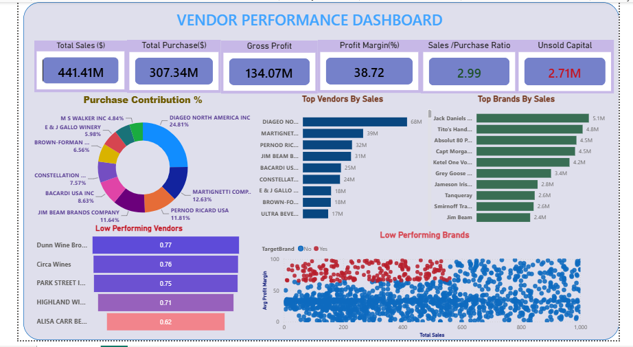

## Project Overview
This project delivers an end-to-end data pipeline and interactive Power BI dashboard designed to evaluate vendor performance, track brand profitability, and optimize inventory turnover across the supply chain. By analyzing transactional data from multiple sources, this tool provides actionable insights into vendor reliability, margin stability, and locked capital.

## 🛠️ Technical Stack
* **Data Engineering (ETL):** Python (custom logging, automated database ingestion)
* **Database & Querying:** SQLite & SQL (Optimized with indexing and CTEs to prevent join explosions)
* **Data Visualization:** Power BI, Seaborn, Matplotlib
* **Statistical Analysis:** SciPy (Two-Sample T-Tests, 95% Confidence Intervals)

## 🎯 Key Objectives & Roadmap
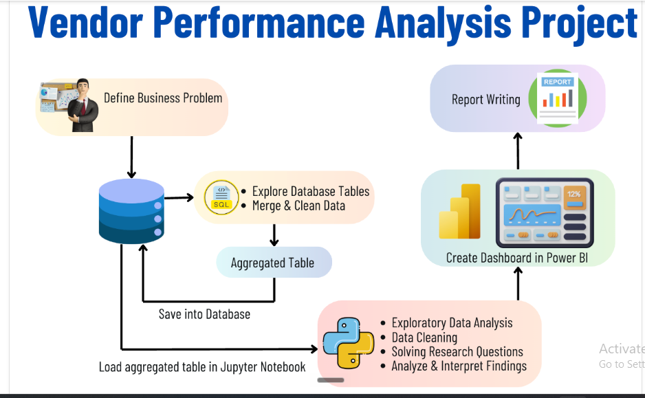

1. **Automate Data Ingestion:** Built a robust Python pipeline to ingest, clean, and standardize multi-source transactional data into a relational database.
2. **Calculate Core KPIs:** Accurately track gross profit, profit margins, and stock turnover rates.
3. **Identify Margin Variance:** Conduct statistical analysis to differentiate between the stable margins of high-performing vendors and the high-variance, premium margins of underperformers.

## 📈 Top Performers & Market Concentration
Our analysis revealed heavy reliance on top-tier vendors. 
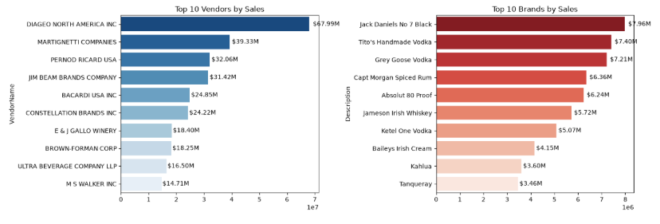
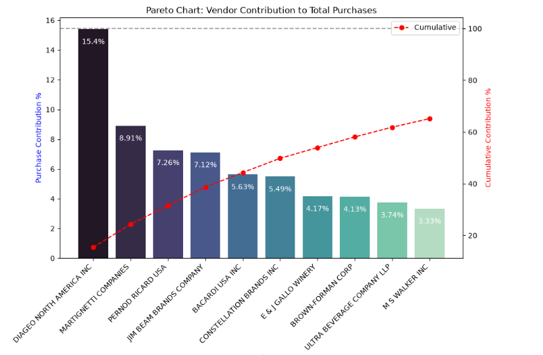

## 💡 Key Business Insights

### 1. Margin Consistency vs. Variance
Statistical analysis (P-Value: 0.0000) revealed a significant difference in profit margins. Top vendors maintain a highly consistent ~31% margin, while low performers show a high-variance ~41.5% margin.
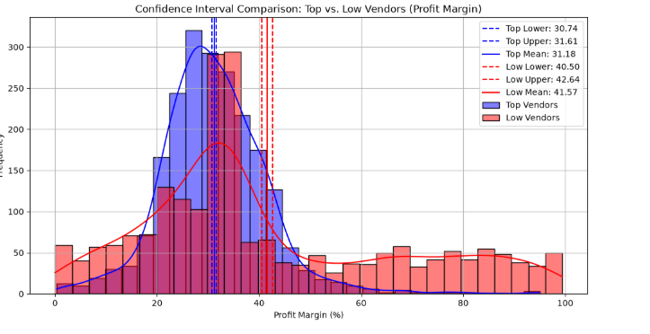

### 2. Volume is the Profit Engine
Correlation analysis proved that gross profit is overwhelmingly driven by overall sales volume, whereas individual purchase prices have virtually no impact on total revenue.
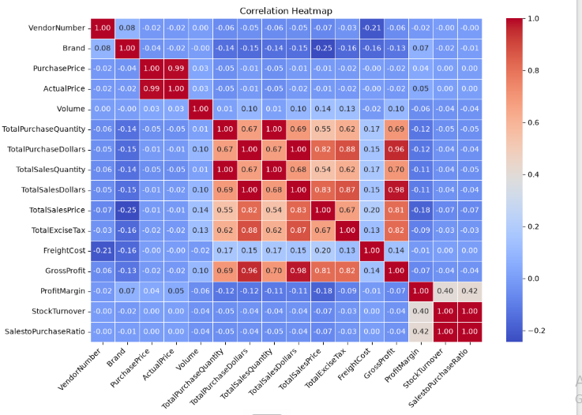

### 3. The Power of Bulk Purchasing
Vendors buying in bulk (Large Order Size) achieve a ~72% reduction in unit cost (dropping to $10.78 per unit), drastically improving margin potential if inventory is managed efficiently.
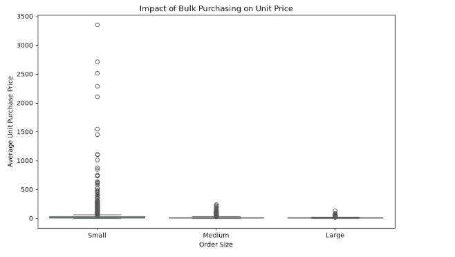

### 4. Target Brands for Promotion
By plotting Total Sales vs. Profit Margin, we identified specific high-margin, low-volume brands that require immediate promotional strategies to unlock their revenue potential.
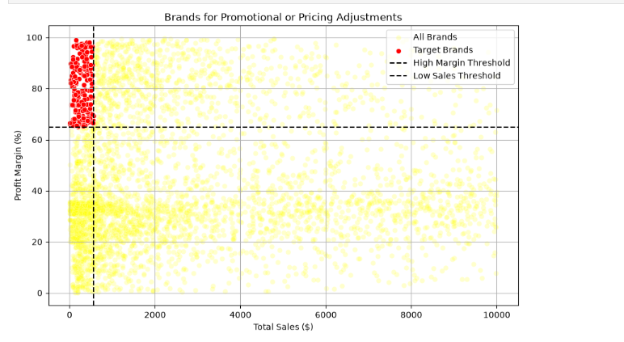

## 🔬 Technical Appendix: Exploratory Data Analysis (EDA)

  
Click to view Data Distributions and Outlier Detection

  
  During the initial ETL phase, I conducted rigorous EDA to ensure data integrity and identify anomalies in pricing and freight costs before pushing to the Power BI dashboard.
  
  **Numerical Distributions:**
  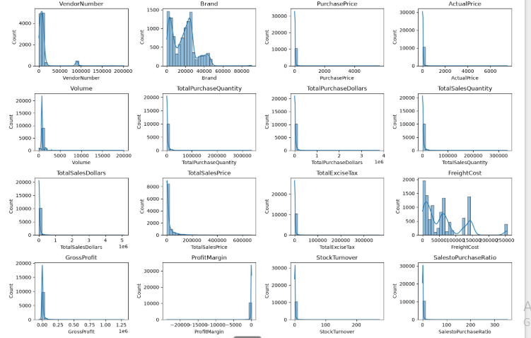

  **Outlier Detection:**
  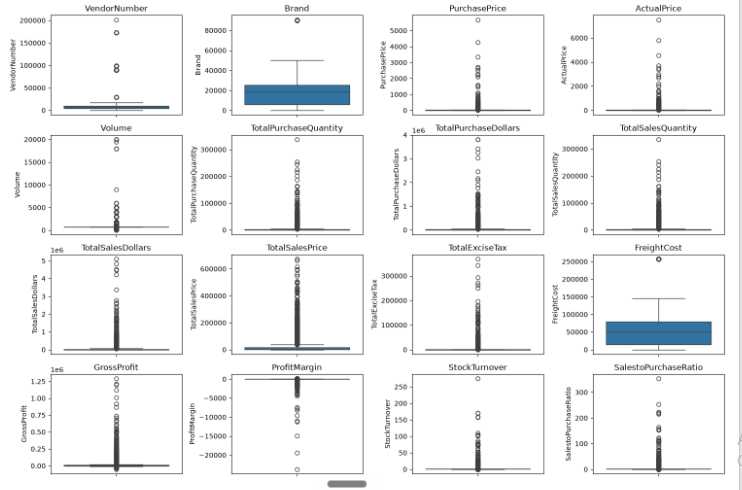
  
  **Categorical Analysis:**
  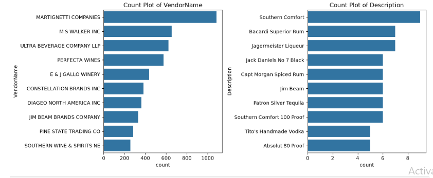

## 📂 Repository Structure
* `data/`: Contains the raw datasets.
* `scripts/`: Python ETL scripts (`ingestion_db.py`, `get_vendor_sales_summary.py`).
* `notebooks/`: Jupyter notebooks detailing the EDA and statistical testing.
* `dashboard/`: The Power BI `.pbix` file.
